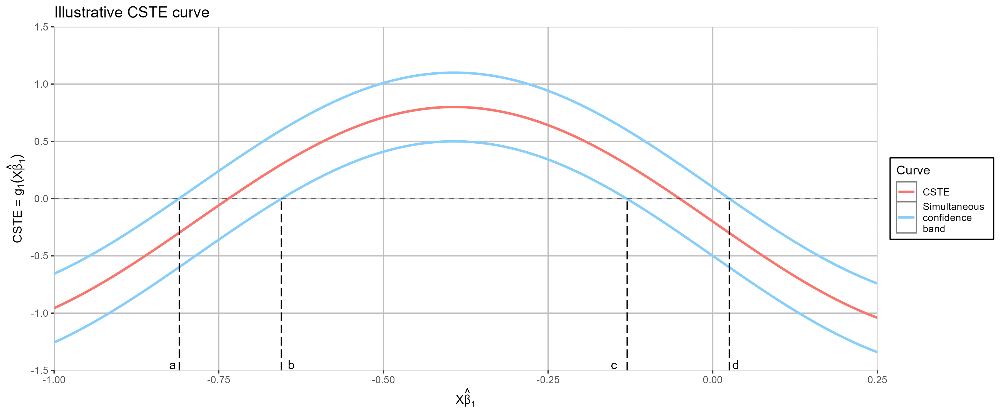

### Introduction of **CSTEapp** (ver 1.0.0)

**CSTEapp** provides a uniform statistical inferential tool, **the Covariate-Specific Treatment Effect (CSTE) curve** for estimating individualized treatment rule.

**CSTEapp** estimates differences of average outcomes between different treatment groups conditional on patients characteristics and provides the corresponding simultaneous confidence intervals. Based on the CSTE curve and the simultaneous confidence intervals, one can decide the subgroups of patients that benefit from each treatment and then make individualized treatment selections.

### Data structure suitable in the **CSTEapp**

*   **Binary outcomes**: Dataset with one binary outcome variable, one binary treatment variable, and single or multiple (even high-dimensional) covariates (e.g., subjects vital information).[\[1-2\]](#1)
    
*   **Survival outcomes**: Datasets with right censored time-to-event outcomes (one time variable and one censoring indicator), one or more binary treatment variable (dummy variables implying multiple treatments), and a single covariate (e.g., the measurements of the biomarker).[\[3-4\]](#4)
    
**CSTEapp** will consider more types of datasets in the future.

--------

### How to read the CSTE curve and choose the optimal treatment

*   Given the observed covariates, estimate **the CSTE curve** and the corresponding **simultaneous confidence intervals** at a certain (usually 0.05) confidence level.   

*   Based on the SCB, identify the cutoff points of **the positive and negative regions** of the CSTE.  
    
*   For a new patient with their covariates (say, $\boldsymbol X=\tilde{\boldsymbol x}$):

    - in the case of binary outcomes, select the optimal treatment for this patient based on the regions where the predicted $\tilde{\boldsymbol x}^\top\hat{\boldsymbol\beta}_1$ (to be shown at the $x$-axis) falls into; 

    - in the case of survival outcomes, select the optimal treatment for this patient based on the regions where the new $\tilde{\boldsymbol x}$ (to be shown at the $x$-axis) falls into.

#### An artificial example

Suppose this CSTE curve was simulated for binary outcomes $Y$, **where $Y=1$ indicated deterioration in health and $Y=0$ otherwise**;  **$Z=1$ indicated assignment of the new treatment and $Z=0$ the old treatment**.

*   If data ($\tilde{\boldsymbol x}^\top\hat{\boldsymbol\beta}_1$) falls into the region $(-1,a]$ or $[d,0.25)$, we have 95\% confidence to conclude that the patient will **benefit from the new treatment**; 

*   If $\tilde{\boldsymbol x}^\top\hat{\boldsymbol\beta}_1$ falls into $[b,c]$, we have 95\% confidence to conclude that the patient will **benefit from the old treatment**; 

*   If $\tilde{\boldsymbol x}^\top\hat{\boldsymbol\beta}_1$ falls into $[a,b]$ or $[c,d]$, **no significant difference** is discovered between these two treatments.

--------
### R package

**CSTE**: Covariate Specific Treatment Effect (CSTE) Curve ([https://CRAN.R-project.org/package=CSTE](https://CRAN.R-project.org/package=CSTE))

--------

#### References

\[1\] Han K, Zhou X, Liu B. CSTE curve for selection of the optimal treatment when outcome is binary. SCIENTIA SINICA Mathematica. 2017;47(4):497–514.

\[2\] Guo W, Zhou XH, Ma S. Estimation of optimal individualized treatment rules using a covariate-specific treatment effect curve with high-dimensional covariates. Journal of the American Statistical Association. 2021;116(533):309–21. [https://doi.org/10.1080/01621459.2020.1865167](https://doi.org/10.1080/01621459.2020.1865167)

\[3\] Zhou XH, Ma Y. BATE curve in assessment of clinical utility of predictive biomarkers. Science China Mathematics. 2012 Aug 18;55(8):1529–52. [http://link.springer.com/10.1007/s11425-012-4473-0](http://link.springer.com/10.1007/s11425-012-4473-0)

\[4\] Ma Y, Zhou XH. Treatment selection in a randomized clinical trial via covariate-specific treatment effect curves. Statistical Methods in Medical Research. 2017 Feb;26(1):124–41. [http://journals.sagepub.com/doi/10.1177/0962280214541724](http://journals.sagepub.com/doi/10.1177/0962280214541724)

-----

<h4 id="release-history">Release history</h4>

<table class="tg">
<thead>
  <tr>
    <th class="tg-0pky">Date</th>
    <th class="tg-0pky">Version</th>
    <th class="tg-0pky">Details</th>
  </tr>
</thead>
<tbody>
  <tr>
    <td class="tg-0pky">2023-09-30 </td>
    <td class="tg-0pky">0.9.0</td>
    <td class="tg-0pky">First release</td>
  </tr>
  <tr>
    <td class="tg-0pky">2024-11-20</td>
    <td class="tg-0pky">1.0.0</td>
    <td class="tg-0pky">Update interface and functions</td>
  </tr>
</tbody>
</table>

